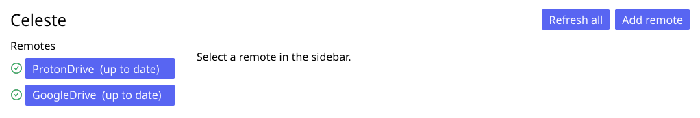
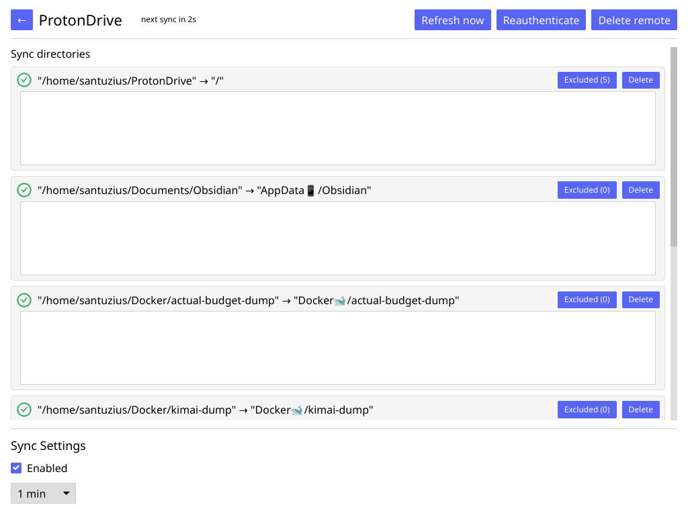

> [!NOTE]
> This is a personal fork of the original project at
> [hwittenborn/celeste](https://github.com/hwittenborn/celeste), maintained by
> Alexander Menzel. See [`NOTICE`](./NOTICE) for the list of modifications
> relative to upstream. The fork is distributed under the same
> [GPL-3.0-or-later](./LICENSE) terms as the original.

# Celeste
Celeste is a GUI file synchronization client

> [!NOTE]
> Built and tested only on Linux

Used components:
- [rclone](https://rclone.org/) for Google Drive
- [go-proton-api](https://github.com/ProtonMail/go-proton-api) for Proton Drive
- [iced](https://iced.rs/) for GUI

## Screenshots
Remotes selection:

Remote page:


## Features
- Two-way sync
- Connecting to multiple cloud providers at the same time
- Ability to add multiple local directories to the same remote
- All credentials are stored at rest in the native Linux keyring
- Background operation: when the window is closed, only the taskbar icon is displayed
- Light/dark theme

## Supported cloud providers
- Google Drive
- Proton Drive

## Why not also add other providers?
- Some of them already have a good Linux integration:
  - [OneDrive](https://abraunegg.github.io)
  - [Dropbox](https://www.dropbox.com/install-linux)
  - [Nextcloud](https://nextcloud.com/install/)
  - etc.
- Other are not of my interest.

## Building
The project ships a `shell.nix` that provides a stable Rust toolchain, Go, and all runtime libraries (Wayland/Vulkan/X11, OpenSSL, rclone). From the repo root:

```sh
# Release build
nix-shell --run 'cargo build --release'

# Run directly
nix-shell --run 'cargo run --release'
```

No global `rustup`, `go`, or system headers are required — everything is pulled in by the shell.

## Installing on Nix
The Nix derivation lives in a sibling repository — [`celeste-nix`](https://github.com/Santuzius/celeste-nix) — so that the source tree and packaging can evolve independently. The package reads the Celeste checkout as its build source, so both repos must be cloned locally:

```sh
git clone https://github.com/Santuzius/celeste        ~/Git/celeste
git clone https://github.com/Santuzius/celeste-nix    ~/Git/celeste-nix
```

Then reference the package from your Nix config, e.g.:

```nix
# configuration.nix (or any module)
{ pkgs, ... }: {
  environment.systemPackages = [
    (pkgs.callPackage /home/<you>/Git/celeste-nix { })
  ];
}
```

Because the package points at an absolute path outside the Nix store, rebuild with `--impure`:

```sh
sudo nixos-rebuild switch --impure
# or, for flakes:
sudo nixos-rebuild switch --flake .#<host> --impure
```

The package uses the pre-built `libceleste_go.a` in `src/go/` (the Nix sandbox has no network access, so `go build` is skipped). That archive is gitignored: cargo's `src/go/build.rs` compiles it and mirrors `libceleste_go.{a,h}` into `src/go/` on any non-Nix build. To refresh it, enter the dev shell and run a plain `cargo build` before packaging.
