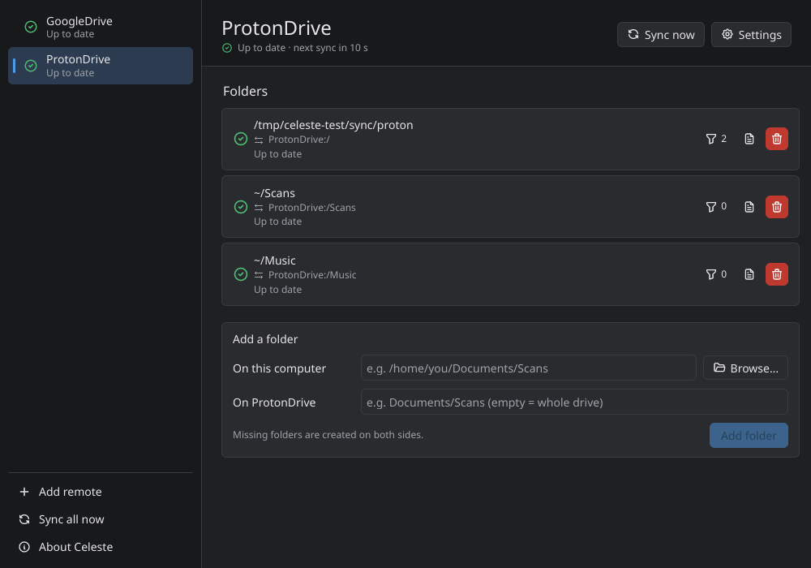
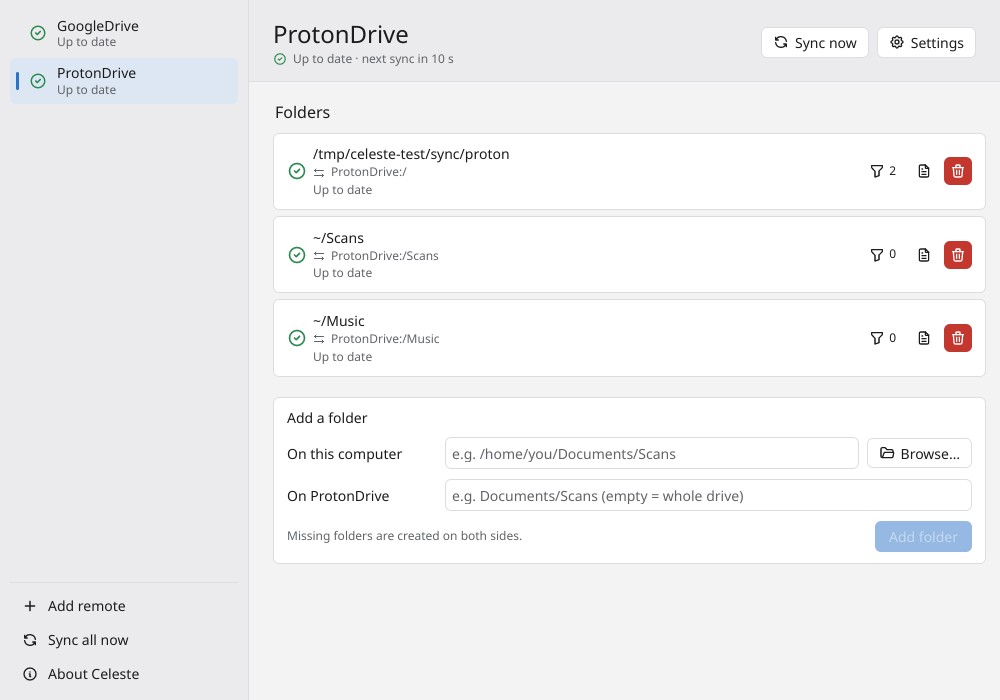
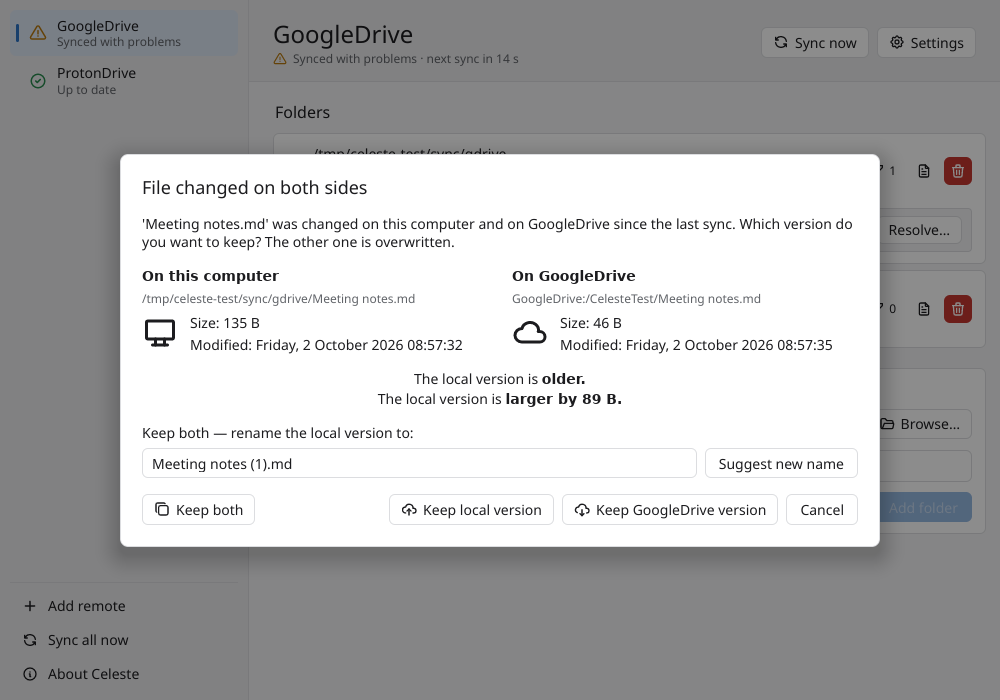

# Celeste
Two-way file sync between folders on your Linux computer or Android phone and Google Drive or Proton Drive, with a desktop window, a tray icon and a phone layout.

> [!NOTE]
> Personal fork of [hwittenborn/celeste](https://github.com/hwittenborn/celeste), maintained by Alexander Menzel; see [About this fork](#about-this-fork). This is a third-party application not officially supported by Google or Proton. Built and tested only on Linux and Android.



## Quick start
1. **Install** Celeste; details are under [Installing](#installing).
   - **Linux, any distribution:** the [AppImage](#appimage) from the [latest release](https://github.com/Santuzius/celeste/releases/latest), or with the [Nix package manager](#nix): `nix profile add github:Santuzius/celeste`
   - **NixOS:** the [module](#nixos)
   - **Android 8 or newer:** the APK from the latest release, best through [Obtainium](#android), which keeps it up to date
2. **Start Celeste.** On Linux it lives in the system tray (on GNOME with the [AppIndicator extension](https://extensions.gnome.org/extension/615/appindicator-support/)), and closing the window keeps it syncing in the background. On Android it syncs in the background with a silent notification.
3. **Add a remote:** click *Add remote* and choose the provider.
   - **Proton Drive:** sign in with your Proton username and password.
   - **Google Drive:** needs your own OAuth client ID, which takes a few minutes in the Google Cloud console ([rclone's guide](https://rclone.org/drive/#making-your-own-client-id)). In the consent screen's **Branding** settings, enter [`https://github.com/Santuzius/celeste/blob/main/PRIVACY.md`](./PRIVACY.md) as **Application privacy policy link** and your own website or social media profile as **Application home page**, e.g. `https://t.me/YourTelegramName`. Then paste client ID and secret into Celeste, click *Connect* and grant access in your browser.
4. **Add a folder:** pick a local folder and the path on the remote it should mirror. Missing folders are created on both sides, and Celeste keeps them in sync at the interval set in the remote's settings.

## Features
- Two-way sync, several folders per account, several accounts at the same time
- Exclusions for sub-folders and files, with a clean-up of copies left behind by an exclusion
- Conflict resolution: a file changed on both sides is never overwritten silently; you keep the local version, the remote one, or both
- Credentials stay on the device: in the system keyring on Linux, encrypted with the Android Keystore on Android
- Starts at login or after the phone's restart (can be switched off), Start / Pause per account
- Light and dark theme, adjustable content size, settings export and import (without sign-ins)





## Installing
### AppImage
For x86_64 distributions with glibc 2.35 or newer (Ubuntu 22.04, Debian 12, Fedora 36 and later). Needs a Secret Service keyring such as GNOME Keyring or KWallet, which most desktops include.

1. Download `Celeste-<version>-x86_64.AppImage` from the [latest release](https://github.com/Santuzius/celeste/releases/latest).
2. Move it to a fixed place under a fixed name, e.g. `~/Applications/Celeste.AppImage`, and make it executable (`chmod +x`).
3. Start it once. Celeste then starts itself at login from exactly this file (switch this off in Preferences).

To update, replace the file, or let [Gear Lever](https://flathub.org/apps/it.mijorus.gearlever) or AppImageUpdate do it.

### Nix
`github:Santuzius/celeste` always gives the latest release; `nix profile upgrade` moves you to a newer one.

Compiling takes a while; to download Celeste instead, add its binary cache to `/etc/nix/nix.conf`:

```
extra-substituters = https://celeste.cachix.org
extra-trusted-public-keys = celeste.cachix.org-1:iGmU8GUPr4AlGAiwmfAIDRhRKZwpIpWcz7DKwQBaRm8=
```

### NixOS
Add the flake to `inputs`:

```nix
celeste.url = "github:Santuzius/celeste";
```

Then enable it through the NixOS module (installs Celeste, its menu entry and a system-wide autostart entry that starts it in the tray; Celeste's own per-user entry from Preferences takes precedence over it):

```nix
# flake.nix outputs, inside nixosSystem { modules = [ … ]; }
inputs.celeste.nixosModules.default
{ programs.celeste.enable = true; }   # programs.celeste.autostart = false; to skip autostart
```

The module also adds Celeste's binary cache (`programs.celeste.binaryCache = false;` to skip), so later rebuilds download Celeste instead of compiling it. This needs the input without `inputs.nixpkgs.follows`.

Alternatively add `inputs.celeste.packages.${system}.default` to `environment.systemPackages` or use `overlays.default`.

### Android
For phones with Android 8 or newer and a 64-bit ARM processor (`arm64-v8a`, nearly every phone since 2017).

- **With [Obtainium](https://obtainium.imranr.dev)** (recommended): *Add app*, enter `https://github.com/Santuzius/celeste` and install. Obtainium then reports new releases and installs them.
- **By hand:** download `Celeste-<version>-arm64-v8a.apk` from the [latest release](https://github.com/Santuzius/celeste/releases/latest) and open it on the phone; Android asks to allow installing from that app.

On its first start Celeste asks for **All files access**, needed to sync folders anywhere in the phone's storage, and for permission to run in the background.

### Snap
A Snap package is prepared (`snap/snapcraft.yaml`, see [doc/snap.md](doc/snap.md)) but not yet published in the Snap Store.

## Building
The project ships a `shell.nix` that provides a stable Rust toolchain, Go, and all runtime libraries (Wayland/Vulkan/X11, OpenSSL, rclone). From the repo root:

```sh
# Release build
nix-shell --run 'cargo build --release'

# Run directly
nix-shell --run 'cargo run --release'
```

No global `rustup`, `go`, or system headers are required — everything is pulled in by the shell.

- **AppImage:** `scripts/build-appimage.sh` builds it in an Ubuntu 22.04 container and needs Docker.
- **Android:** see [android/README.md](android/README.md).
- **Releases:** see [doc/release.md](doc/release.md).

## Used components
- [rclone](https://rclone.org/) for Google Drive (other rclone-supported providers would be possible, but are not implemented)
- [go-proton-api](https://github.com/ProtonMail/go-proton-api) for Proton Drive
- [iced](https://iced.rs/) for the GUI, on Android through [iced_android](https://github.com/Santuzius/iced_android)

## FAQ
### Why not also add other providers?
- As the sole maintainer I don't have enough time for this.
- Some of them already have a good Linux integration:
  - [OneDrive](https://abraunegg.github.io)
  - [Dropbox](https://www.dropbox.com/install-linux)
  - [Nextcloud](https://nextcloud.com/install/)
  - etc.

### Why not Flatpak, F-Droid or distribution packages?
This is my first published app, and packaging takes time. The AppImage runs on most distributions, and the Snap package is the next step.

## Privacy
Celeste runs entirely on your computer or phone and sends nothing to the developer. See the [privacy policy](./PRIVACY.md).

## About this fork
This is a personal fork of the original project at [hwittenborn/celeste](https://github.com/hwittenborn/celeste), maintained by Alexander Menzel. See [`NOTICE`](./NOTICE) for the list of modifications relative to upstream. The fork is distributed under the same [GPL-3.0-or-later](./LICENSE) terms as the original.
