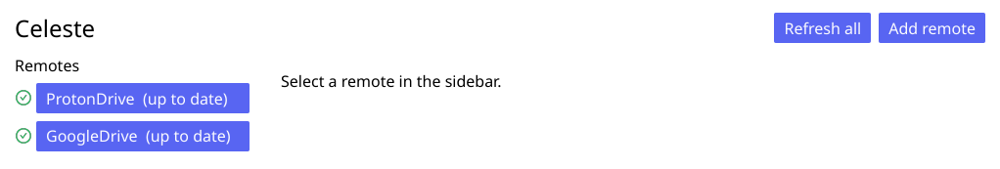
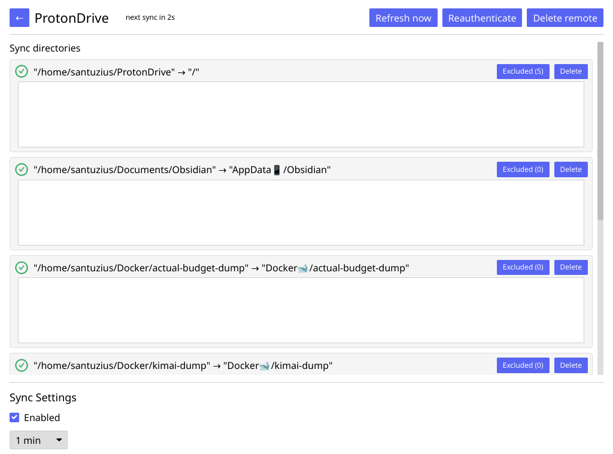

> [!NOTE]
> This is a personal fork of the original project at
> [hwittenborn/celeste](https://github.com/hwittenborn/celeste), maintained by
> Alexander Menzel. See [`NOTICE`](./NOTICE) for the list of modifications
> relative to upstream. The fork is distributed under the same
> [GPL-3.0-or-later](./LICENSE) terms as the original.

# Celeste
Celeste is a GUI file synchronization client

> [!NOTE]
> Built and tested only on Linux

## Supported cloud providers
- Google Drive
- Proton Drive

> [!IMPORTANT]
> Google Drive needs your own OAuth client ID, see [rclone's guide](https://rclone.org/drive/#making-your-own-client-id). In the consent screen's **Branding** settings, you can enter [`https://github.com/Santuzius/celeste/blob/develop/PRIVACY.md`](./PRIVACY.md) as **Application privacy policy link** and your own website or social media profile as **Application home page**.

## Features
- Two-way sync
- Connecting to multiple cloud providers at the same time
- Ability to add multiple local directories to the same remote
- All credentials are stored at rest in the native Linux keyring
- Background operation: when the window is closed, only the taskbar icon is displayed
- Light/dark theme

## Screenshots
Remotes selection:

Remote page:


## Used components:
- [rclone](https://rclone.org/) for Google Drive
  - integration of other [rclone](https://rclone.org/)-supported drives is possible, but not implemented
- [go-proton-api](https://github.com/ProtonMail/go-proton-api) for Proton Drive
- [iced](https://iced.rs/) for GUI

## Why not also add other providers?
- As the sole maintainer I don't have enough time for this.
- Some of them already have a good Linux integration:
  - [OneDrive](https://abraunegg.github.io)
  - [Dropbox](https://www.dropbox.com/install-linux)
  - [Nextcloud](https://nextcloud.com/install/)
  - etc.

## Why not publish Celeste in Flatpak or similar?
- This would be my first publication, so I don't have any experience getting it done quickly yet.
- That's why I don't have enough time for it.

## Building
The project ships a `shell.nix` that provides a stable Rust toolchain, Go, and all runtime libraries (Wayland/Vulkan/X11, OpenSSL, rclone). From the repo root:

```sh
# Release build
nix-shell --run 'cargo build --release'

# Run directly
nix-shell --run 'cargo run --release'
```

No global `rustup`, `go`, or system headers are required — everything is pulled in by the shell.

## Installing on NixOS
Celeste ships a flake. Add it as an input — this one line is all you need in `inputs`:

```nix
celeste.url = "github:Santuzius/celeste";
```

Then enable it through the NixOS module (installs Celeste, its menu entry and an autostart entry that starts it in the tray):

```nix
# flake.nix outputs, inside nixosSystem { modules = [ … ]; }
inputs.celeste.nixosModules.default
{ programs.celeste.enable = true; }   # programs.celeste.autostart = false; to skip autostart
```

Alternatively add `inputs.celeste.packages.${system}.default` to `environment.systemPackages`, use `overlays.default`, or try it without installing: `nix run github:Santuzius/celeste`. Pin a release with `github:Santuzius/celeste/v0.17.0`.

The package builds everything in the Nix sandbox, including the Go archive (vendored Go modules) — no `--impure` needed. When `src/go/go.mod` or `go.sum` change, update `vendorHash` in `nix/package.nix`; when the `src/go/proton-api` submodule moves, update its pinned `rev` and `hash` there.
